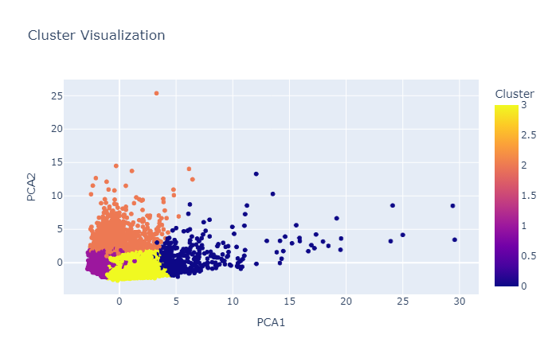

# Análisis de Segmentación de Mercado con Python

  

## Índice
1. [Introducción](#introducción)
2. [Objetivo](#objetivo)
3. [Dataset](#dataset)
3. [Método](#método)
4. [Tecnologías Utilizadas](#tecnologías-utilizadas)
7. [Flujo de Datos](#flujo-de-datos)
7. [Visualizaciones](#visualizaciones)
7. [Resultados](#resultados)
9. [Mejoras Futuras](#mejoras-futuras)
11. [Conclusión](#conclusión)

---

## Introducción

Este proyecto utiliza Python y técnicas avanzadas de ciencia de datos para realizar un análisis de segmentación de mercado. Implementamos el algoritmo **k-means** y visualizamos los resultados para identificar patrones de comportamiento en clientes a partir de datos normalizados y procesados. 

---

## Objetivo

Identificar grupos de clientes (clusters) con características similares para personalizar estrategias de negocio, mejorar el servicio y optimizar los recursos disponibles.

---

## Dataset

Este dataset contiene 17 variables de comportamiento y utilizaremos PCA (Análisis de características principales) para designar un cluster a cada cliente.

- **CUSTID**: Identificación del titular de la tarjeta de crédito (Categorical).
- **BALANCE**: Monto del saldo restante en su cuenta para realizar compras.
- **BALANCEFREQUENCY**: Frecuencia con la que se actualiza el saldo, puntuación entre 0 y 1 (1 = actualizado frecuentemente, 0 = no actualizado frecuentemente).
- **PURCHASES**: Monto total de compras realizadas desde la cuenta.
- **ONEOFFPURCHASES**: Monto máximo de compra realizado en una sola transacción.
- **INSTALLMENTSPURCHASES**: Monto total de compras realizadas a plazos.
- **CASHADVANCE**: Monto de dinero en efectivo adelantado proporcionado al usuario.
- **PURCHASESFREQUENCY**: Frecuencia con la que se realizan compras, puntuación entre 0 y 1 (1 = compras frecuentes, 0 = compras no frecuentes).
- **ONEOFFPURCHASESFREQUENCY**: Frecuencia con la que se realizan compras en una sola transacción (1 = frecuentes, 0 = no frecuentes).
- **PURCHASESINSTALLMENTSFREQUENCY**: Frecuencia con la que se realizan compras a plazos (1 = frecuentes, 0 = no frecuentes).
- **CASHADVANCEFREQUENCY**: Frecuencia con la que se realizan adelantos en efectivo.
- **CASHADVANCETRX**: Número de transacciones realizadas con "adelantos en efectivo".
- **PURCHASESTRX**: Número de transacciones de compra realizadas.
- **CREDITLIMIT**: Límite de crédito de la tarjeta para el usuario.
- **PAYMENTS**: Monto de pagos realizados por el usuario.
- **MINIMUM_PAYMENTS**: Monto mínimo de pagos realizados por el usuario.
- **PRCFULLPAYMENT**: Porcentaje de pago completo realizado por el usuario.
- **TENURE**: Antigüedad del servicio de tarjeta de crédito para el usuario.

---

## Método

1. **Preparación de Datos**:
   - Cargamos un dataset con datos de clientes (`CC GENERAL.csv`).
   - Imputamos valores nulos con ceros (mejorable en el futuro con la media o mediana).

2. **Transformación y Normalización**:
   - Convertimos los datos en vectores.
   - Normalizamos los valores para que estén entre -1 y 1 usando `StandardScaler`.

3. **Clustering con K-means**:
   - Aplicamos el método del codo (**Elbow Method**) para determinar el número óptimo de clusters.
   - Ejecutamos el algoritmo k-means con los parámetros obtenidos.

  

4. **Visualización**:
   - Utilizamos PCA (Análisis de Componentes Principales) para reducir las dimensiones a 2D.
   - Generamos gráficos interactivos con `plotly`.

5. **Resultados**:
   - Creamos un nuevo DataFrame con la asignación de cada cliente a un cluster.

---

## Tecnologías Utilizadas

| Tecnología           | Tipo            | Propósito                               |
|----------------------|-----------------|---------------------------------------|
| **Python**           | Lenguaje       | Desarrollo del análisis               |
| **pandas**           | Biblioteca     | Manipulación y análisis de datos      |
| **scikit-learn**     | Biblioteca     | Algoritmos de clustering y PCA        |
| **plotly**           | Biblioteca     | Visualización interactiva             |
| **openpyxl**         | Biblioteca     | Manejo de archivos Excel              |

---

## Flujo de Datos
1. **Carga de datos**: Se importa el dataset desde `CC GENERAL.csv`.
2. **Preprocesamiento**: 
   - Se llenan valores nulos con ceros (o alternativas como promedios en mejoras futuras).
   - Los datos son transformados y normalizados usando `StandardScaler` para que los valores estén en rangos comparables.
3. **Análisis**:
   - Determinación del número óptimo de clusters mediante el **método del codo** (WCSS).
   - Aplicación del algoritmo K-Means para segmentación.
4. **Resultados**:
   - Se generan gráficos y se guardan resultados en un archivo Excel.
   - Visualización de clusters usando PCA para reducción de dimensionalidad.

---

## Visualizaciones
1. **Gráfico del Método del Codo**:
   - Ayuda a determinar el número óptimo de clusters (punto de inflexión en WCSS).

  

2. **Tabla de los Cluster para cada cliente y su PCA**:
   - Nos da el cluster asignado para cada CUST_ID de cada cliente.

  

3. **Gráfico de Dispersión**:
   - Muestra la asignación y separación de clientes por tipo en clusters utilizando PCA.

  

## Resultados

En nuestra última imagen podemos ver como se han organizado o encontrado 4 tipos de clientes diferenciados por sus comportamientos utilizando PCA. De esta forma podremos asignar campañas personalizadas a cada uno.

---

### Mejoras Futuras
1. **Automatización**:
   - Implementar flujos de trabajo con **Airflow** o **Prefect**.
2. **Escalabilidad**:
   - Migrar procesamiento a **AWS Lambda** para mayor rendimiento.
   - Almacenamiento en **S3** y análisis con **Athena**.
3. **APIs**:
   - Crear endpoints con **FastAPI** para consultar clusters en tiempo real.
4. **Mejoras Analíticas**:
   - Reemplazar valores nulos con promedios o valores calculados.
   - Explorar técnicas avanzadas como DBSCAN para análisis más detallado.

---

#### Conclusión:

Este proyecto demuestra cómo implementar un proceso ETL efectivo para segmentación de mercado, desde la extracción y transformación de datos hasta la aplicación de modelos analíticos. Ofrece un marco inicial escalable para futuras mejoras, como integración con APIs, automatización en la nube, y visualizaciones avanzadas.